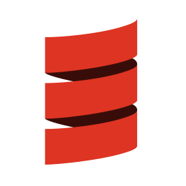
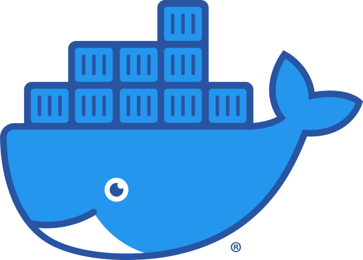

# Hi 👋, I'm Neil ⚡

Rust enjoyer , currently working as React Native developer .

Currently learning [Tauri](https://tauri.app/)  & [SurrealDB](https://surrealdb.com/) .

### Technologies | Languages | Tools 🏗️:

<a href="https://www.typescriptlang.org/">

  

